AirBnB Exploratory Data Analysis
================

``` r
library(tidyverse)
```

    ## Loading tidyverse: ggplot2
    ## Loading tidyverse: tibble
    ## Loading tidyverse: tidyr
    ## Loading tidyverse: readr
    ## Loading tidyverse: purrr
    ## Loading tidyverse: dplyr

    ## Conflicts with tidy packages ----------------------------------------------

    ## filter(): dplyr, stats
    ## lag():    dplyr, stats

``` r
library(gridExtra)
```

    ## 
    ## Attaching package: 'gridExtra'

    ## The following object is masked from 'package:dplyr':
    ## 
    ##     combine

``` r
library(broom)
library(GGally)
```

    ## 
    ## Attaching package: 'GGally'

    ## The following object is masked from 'package:dplyr':
    ## 
    ##     nasa

``` r
library(ggcorrplot)
library(reshape2)
```

    ## 
    ## Attaching package: 'reshape2'

    ## The following object is masked from 'package:tidyr':
    ## 
    ##     smiths

``` r
airBColor<- '#ff5a5f'
```

``` r
df_listing_raw <-read.csv('data/listing_with_reviews_PCA.csv')
dim(df_listing_raw)
```

    ## [1] 9208  521

``` r
df_listing_raw$amenities__TV <-ifelse(df_listing_raw$amenities__TV>0,1,0)
```

### Drop the occasional renters (no availability for the next 90 days and no reviews)

#### Check for data of last review

``` r
ggplot(df_listing_raw,aes(x=availability_90,fill=is.na(last_review)))+ geom_histogram( position="dodge")
```

    ## `stat_bin()` using `bins = 30`. Pick better value with `binwidth`.

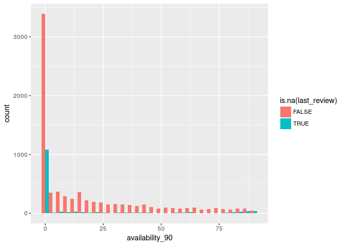 \#\#\#\# Last review vs availability

``` r
ggplot(df_listing_raw,aes(x=availability_90,y=last_review,group=availability_90))+geom_boxplot(color=airBColor,fill = NA,alpha=.1)
```

    ## Warning: Removed 1505 rows containing non-finite values (stat_boxplot).


``` r
ggplot(df_listing_raw,aes(x=availability_90,y=reviews_per_month))+geom_jitter(color=airBColor,fill = NA,alpha=.2)
```

    ## Warning: Removed 1505 rows containing missing values (geom_point).

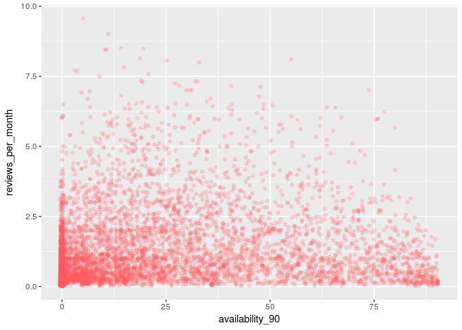

``` r
ggplot(df_listing_raw %>% filter(!is.na(last_review)),aes(x=availability_90,y=reviews_per_month,color+last_review))+geom_jitter(color=airBColor,fill = NA,alpha=.2,size=.5)
```

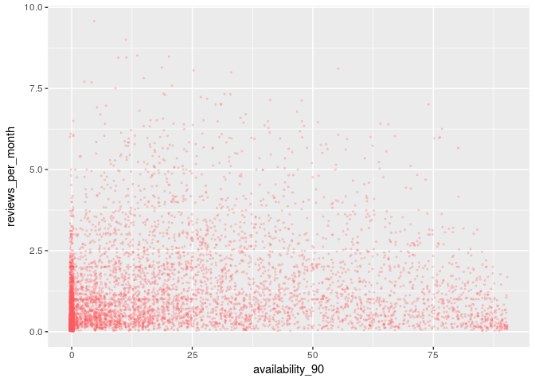

``` r
df_listing<-df_listing_raw %>% filter(reviews_per_month>0.5 & availability_90>0 & availability_90<80) %>% select(-text_experiences_offered)
dim(df_listing)
```

    ## [1] 3085  520

``` r
print (table(sapply(df_listing, class)))
```

    ## 
    ##  factor integer numeric 
    ##      15      60     445

``` r
colos_text<-df_listing %>% select(which(sapply(.,is.factor))) %>% colnames(.)
print (colos_text)
```

    ##  [1] "host_name"                  "text_name"                 
    ##  [3] "text_summary"               "text_space"                
    ##  [5] "text_description"           "text_neighborhood_overview"
    ##  [7] "text_notes"                 "text_transit"              
    ##  [9] "text_access"                "text_interaction"          
    ## [11] "text_house_rules"           "text_host_about"           
    ## [13] "text_language"              "comments"                  
    ## [15] "good_bad_review"

``` r
ggplot(df_listing,aes(x=availability_90))+ geom_histogram(bins=100,fill=airBColor)+ggtitle("Full Appartment availability 90 coming days")
```

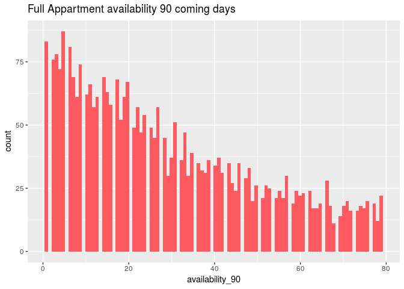

``` r
ggplot(df_listing,aes(x=last_review))+ geom_histogram(bins=100,fill=airBColor)+ggtitle("last review age (days)")
```

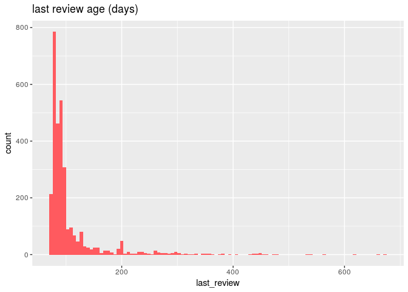

``` r
ggplot(df_listing ,aes(x=reviews_per_month))+ geom_histogram(bins=30, fill=airBColor)+ggtitle("Full Appartment reviews per Month")
```

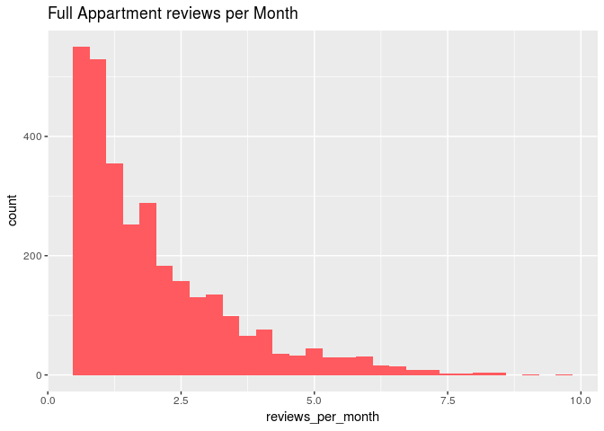

``` r
ggplot(df_listing ,aes(x=availability_90,y=reviews_per_month))+geom_jitter(alpha=.2,color=airBColor)+geom_smooth(method = 'lm')
```


``` r
ggplot(df_listing ,aes(x=as.factor(availability_90),y=reviews_per_month))+geom_boxplot()
```

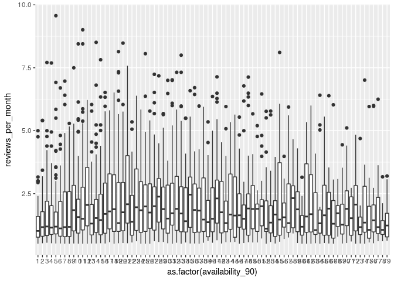 \#\#\#\# Amenities : select only balanced features

``` r
df_listing_amenities <- df_listing %>% select(contains('amenities_'))
df_listing_amenities <-df_listing_amenities %>% select(which(colMeans(.) > 0.1 &colMeans(.) <0.9) ) 


ggplot(data = melt(df_listing_amenities), mapping = aes(x =as.factor(value))) + geom_histogram(bins = 30,stat="count",fill=airBColor) + facet_wrap(~variable, scales = 'fixed') +theme(strip.text.x = element_text(size = 6), axis.text.y = element_text(size=6))
```

    ## No id variables; using all as measure variables

    ## Warning: Ignoring unknown parameters: binwidth, bins, pad

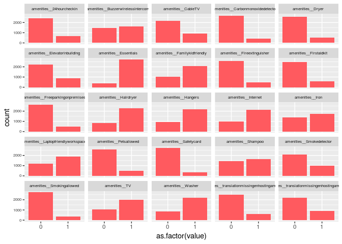

``` r
cols_amenies <-colnames(df_listing_amenities)
cols_amenies
```

    ##  [1] "amenities__24hourcheckin"                       
    ##  [2] "amenities__Buzzerwirelessintercom"              
    ##  [3] "amenities__CableTV"                             
    ##  [4] "amenities__Carbonmonoxidedetector"              
    ##  [5] "amenities__Dryer"                               
    ##  [6] "amenities__Elevatorinbuilding"                  
    ##  [7] "amenities__Essentials"                          
    ##  [8] "amenities__Familykidfriendly"                   
    ##  [9] "amenities__Fireextinguisher"                    
    ## [10] "amenities__Firstaidkit"                         
    ## [11] "amenities__Freeparkingonpremises"               
    ## [12] "amenities__Hairdryer"                           
    ## [13] "amenities__Hangers"                             
    ## [14] "amenities__Internet"                            
    ## [15] "amenities__Iron"                                
    ## [16] "amenities__Laptopfriendlyworkspace"             
    ## [17] "amenities__Petsallowed"                         
    ## [18] "amenities__Safetycard"                          
    ## [19] "amenities__Shampoo"                             
    ## [20] "amenities__Smokedetector"                       
    ## [21] "amenities__Smokingallowed"                      
    ## [22] "amenities__TV"                                  
    ## [23] "amenities__Washer"                              
    ## [24] "amenities__translationmissingenhostingamenity49"
    ## [25] "amenities__translationmissingenhostingamenity50"

### Rough linear model

``` r
colos <- grep('amenities|PC',colnames(df_listing),value = TRUE)
colos<-paste0(colos, collapse="+")
formula <- paste("availability_90 ~ ",colos,sep = "")
formula
```

    ## [1] "availability_90 ~ amenities__+amenities__24hourcheckin+amenities__Accessibleheightbed+amenities__Accessibleheighttoilet+amenities__Airconditioning+amenities__BBQgrill+amenities__Babybath+amenities__Babymonitor+amenities__Babysitterrecommendations+amenities__Bathtub+amenities__Beachessentials+amenities__Bedlinens+amenities__Breakfast+amenities__Buzzerwirelessintercom+amenities__CableTV+amenities__Carbonmonoxidedetector+amenities__Cats+amenities__Changingtable+amenities__Childrensbooksandtoys+amenities__Childrensdinnerware+amenities__Cleaningbeforecheckout+amenities__Coffeemaker+amenities__Cookingbasics+amenities__Crib+amenities__Disabledparkingspot+amenities__Dishesandsilverware+amenities__Dishwasher+amenities__Dogs+amenities__Doorman+amenities__DoormanEntry+amenities__Dryer+amenities__Elevatorinbuilding+amenities__Essentials+amenities__Ethernetconnection+amenities__Extrapillowsandblankets+amenities__Familykidfriendly+amenities__Fireextinguisher+amenities__Fireplaceguards+amenities__Firmmatress+amenities__Firstaidkit+amenities__Flatsmoothpathwaytofrontdoor+amenities__Freeparkingonpremises+amenities__Freeparkingonstreet+amenities__Gameconsole+amenities__Gardenorbackyard+amenities__Gym+amenities__Hairdryer+amenities__Hangers+amenities__Heating+amenities__Highchair+amenities__Hottub+amenities__Hotwater+amenities__Indoorfireplace+amenities__Internet+amenities__Iron+amenities__Keypad+amenities__Kitchen+amenities__Laptopfriendlyworkspace+amenities__Lockonbedroomdoor+amenities__Lockbox+amenities__Longtermstaysallowed+amenities__Luggagedropoffallowed+amenities__Microwave+amenities__Otherpets+amenities__Outletcovers+amenities__Oven+amenities__PacknPlaytravelcrib+amenities__Paidparkingoffpremises+amenities__Pathtoentrancelitatnight+amenities__Patioorbalcony+amenities__Petsallowed+amenities__Petsliveonthisproperty+amenities__Pocketwifi+amenities__Pool+amenities__Privateentrance+amenities__Privatelivingroom+amenities__Refrigerator+amenities__Roomdarkeningshades+amenities__Safetycard+amenities__SelfCheckIn+amenities__Shampoo+amenities__Singlelevelhome+amenities__Smartlock+amenities__Smokedetector+amenities__Smokingallowed+amenities__Stairgates+amenities__Stepfreeaccess+amenities__Stove+amenities__Suitableforevents+amenities__TV+amenities__Tablecornerguards+amenities__Washer+amenities__WasherDryer+amenities__Wheelchairaccessible+amenities__Wideclearancetobed+amenities__Wideclearancetoshowerandtoilet+amenities__Widedoorway+amenities__Widehallwayclearance+amenities__Windowguards+amenities__WirelessInternet+amenities__translationmissingenhostingamenity49+amenities__translationmissingenhostingamenity50+reviews_PC_1+reviews_PC_2+reviews_PC_3+reviews_PC_4+reviews_PC_5+reviews_PC_6+reviews_PC_7+reviews_PC_8+reviews_PC_9+reviews_PC_10+reviews_PC_11+reviews_PC_12+reviews_PC_13+reviews_PC_14+reviews_PC_15+reviews_PC_16+reviews_PC_17+reviews_PC_18+reviews_PC_19+reviews_PC_20+reviews_PC_21+reviews_PC_22+reviews_PC_23+reviews_PC_24+reviews_PC_25+reviews_PC_26+reviews_PC_27+reviews_PC_28+reviews_PC_29+reviews_PC_30+reviews_PC_31+reviews_PC_32+reviews_PC_33+reviews_PC_34+reviews_PC_35+reviews_PC_36+reviews_PC_37+reviews_PC_38+reviews_PC_39+reviews_PC_40+reviews_PC_41+reviews_PC_42+reviews_PC_43+reviews_PC_44+reviews_PC_45+reviews_PC_46+reviews_PC_47+reviews_PC_48+reviews_PC_49+reviews_PC_50+reviews_PC_51+reviews_PC_52+reviews_PC_53+reviews_PC_54+reviews_PC_55+reviews_PC_56+reviews_PC_57+reviews_PC_58+reviews_PC_59+reviews_PC_60+reviews_PC_61+reviews_PC_62+reviews_PC_63+reviews_PC_64+reviews_PC_65+reviews_PC_66+reviews_PC_67+reviews_PC_68+reviews_PC_69+reviews_PC_70+reviews_PC_71+reviews_PC_72+reviews_PC_73+reviews_PC_74+reviews_PC_75+reviews_PC_76+reviews_PC_77+reviews_PC_78+reviews_PC_79+reviews_PC_80+reviews_PC_81+reviews_PC_82+reviews_PC_83+reviews_PC_84+reviews_PC_85+reviews_PC_86+reviews_PC_87+reviews_PC_88+reviews_PC_89+reviews_PC_90+reviews_PC_91+reviews_PC_92+reviews_PC_93+reviews_PC_94+reviews_PC_95+reviews_PC_96+reviews_PC_97+reviews_PC_98+reviews_PC_99+reviews_PC_100+reviews_PC_101+reviews_PC_102+reviews_PC_103+reviews_PC_104+reviews_PC_105+reviews_PC_106+reviews_PC_107+reviews_PC_108+reviews_PC_109+reviews_PC_110+reviews_PC_111+reviews_PC_112+reviews_PC_113+reviews_PC_114+reviews_PC_115+reviews_PC_116+reviews_PC_117+reviews_PC_118+reviews_PC_119+reviews_PC_120+reviews_PC_121+reviews_PC_122+reviews_PC_123+reviews_PC_124+reviews_PC_125+reviews_PC_126+reviews_PC_127+reviews_PC_128+reviews_PC_129+reviews_PC_130+reviews_PC_131+reviews_PC_132+reviews_PC_133+reviews_PC_134+reviews_PC_135+reviews_PC_136+reviews_PC_137+reviews_PC_138+reviews_PC_139+reviews_PC_140+reviews_PC_141+reviews_PC_142+reviews_PC_143+reviews_PC_144+reviews_PC_145+reviews_PC_146+reviews_PC_147+reviews_PC_148+reviews_PC_149+reviews_PC_150+reviews_PC_151+reviews_PC_152+reviews_PC_153+reviews_PC_154+reviews_PC_155+reviews_PC_156+reviews_PC_157+reviews_PC_158+reviews_PC_159+reviews_PC_160+reviews_PC_161+reviews_PC_162+reviews_PC_163+reviews_PC_164+reviews_PC_165+reviews_PC_166+reviews_PC_167+reviews_PC_168+reviews_PC_169+reviews_PC_170+reviews_PC_171+reviews_PC_172+reviews_PC_173+reviews_PC_174+reviews_PC_175+reviews_PC_176+reviews_PC_177+reviews_PC_178+reviews_PC_179+reviews_PC_180+reviews_PC_181+reviews_PC_182+reviews_PC_183+reviews_PC_184+reviews_PC_185+reviews_PC_186+reviews_PC_187+reviews_PC_188+reviews_PC_189+reviews_PC_190+reviews_PC_191+reviews_PC_192+reviews_PC_193+reviews_PC_194+reviews_PC_195+reviews_PC_196+reviews_PC_197+reviews_PC_198+reviews_PC_199+reviews_PC_200+reviews_PC_201+reviews_PC_202+reviews_PC_203+reviews_PC_204+reviews_PC_205+reviews_PC_206+reviews_PC_207+reviews_PC_208+reviews_PC_209+reviews_PC_210+reviews_PC_211+reviews_PC_212+reviews_PC_213+reviews_PC_214+reviews_PC_215+reviews_PC_216+reviews_PC_217+reviews_PC_218+reviews_PC_219+reviews_PC_220+reviews_PC_221+reviews_PC_222+reviews_PC_223+reviews_PC_224+reviews_PC_225+reviews_PC_226+reviews_PC_227+reviews_PC_228+reviews_PC_229+reviews_PC_230+reviews_PC_231+reviews_PC_232+reviews_PC_233+reviews_PC_234+reviews_PC_235+reviews_PC_236+reviews_PC_237+reviews_PC_238+reviews_PC_239+reviews_PC_240+reviews_PC_241+reviews_PC_242+reviews_PC_243+reviews_PC_244+reviews_PC_245+reviews_PC_246+reviews_PC_247+reviews_PC_248+reviews_PC_249+reviews_PC_250+reviews_PC_251+reviews_PC_252+reviews_PC_253+reviews_PC_254+reviews_PC_255+reviews_PC_256+reviews_PC_257+reviews_PC_258+reviews_PC_259+reviews_PC_260+reviews_PC_261+reviews_PC_262+reviews_PC_263+reviews_PC_264+reviews_PC_265+reviews_PC_266+reviews_PC_267+reviews_PC_268+reviews_PC_269+reviews_PC_270+reviews_PC_271+reviews_PC_272+reviews_PC_273+reviews_PC_274+reviews_PC_275+reviews_PC_276+reviews_PC_277+reviews_PC_278+reviews_PC_279+reviews_PC_280+reviews_PC_281+reviews_PC_282+reviews_PC_283+reviews_PC_284+reviews_PC_285+reviews_PC_286+reviews_PC_287+reviews_PC_288+reviews_PC_289+reviews_PC_290+reviews_PC_291+reviews_PC_292+reviews_PC_293+reviews_PC_294+reviews_PC_295+reviews_PC_296+reviews_PC_297+reviews_PC_298+reviews_PC_299+reviews_PC_300"

``` r
options(max.print=5.5E5)
lm<- lm(availability_90~.,df_listing%>% select(-one_of(c(colos_text,c('availability_30','availability_60','availability_365','id')))))
summary(lm)$adj.r.squared
```

    ## [1] 0.5938747

``` r
top_corr<- tidy(lm) %>% filter(p.value<.05)  %>% top_n(n = -10,wt = p.value) %>%pull(term)
```

``` r
colos<-paste0(top_corr, collapse="+")
formula <- paste("availability_90 ~ ",colos,sep = "")
formula
```

    ## [1] "availability_90 ~ price+guests_included+extra_people+cancellation_policy+bed_type_Airbed+availability_60_previous_month+availability_90_previous_month+reviews_PC_54+reviews_PC_156+reviews_PC_249"

``` r
model<-lm(formula,df_listing)
summary(model)$adj.r.squared
```

    ## [1] 0.5929228

Correlations
------------

``` r
top_corr <- c(top_corr,'availability_90')
ggpairs(df_listing, columns = top_corr, title = "",  
  axisLabels = "show", columnLabels = colnames(df_listing[, top_corr]))
```

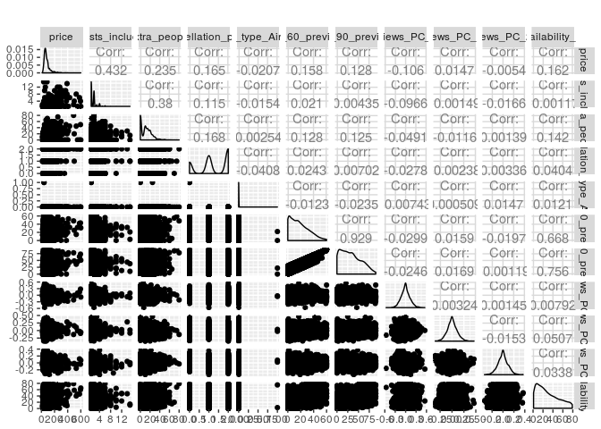

``` r
corr <- round(cor(df_listing %>% select(one_of(c(top_corr,'availability_90') ))),3)
ggcorrplot(corr, hc.order = TRUE, 
           type = "lower", 
           lab = FALSE, 
           lab_size = 3, 
           method="square", 
           colors = c("red", "white", "blue"), 
           title="Correlogram of Selected variables", 
           ggtheme=theme_bw)
```

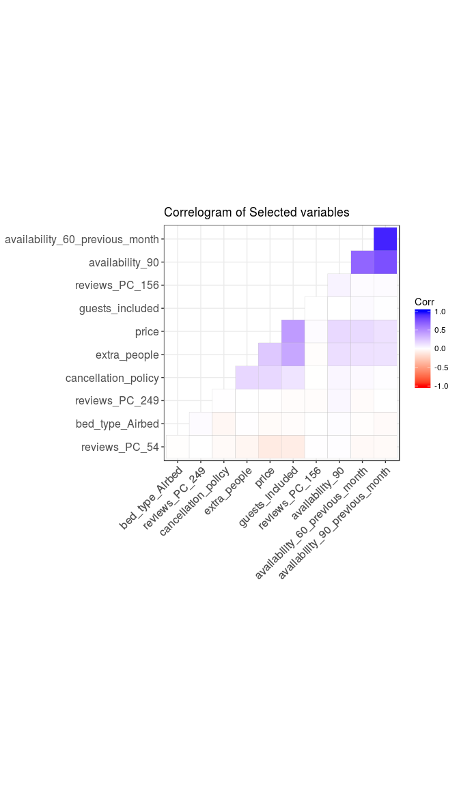

``` r
df_listing_top_features <- df_listing %>% select(one_of(c(top_corr,'availability_90')))
ggplot(data = melt(df_listing_top_features), mapping = aes(x = value)) + 
    geom_histogram(bins = 60, fill=airBColor) + facet_wrap(~variable, scales = 'free')
```

    ## No id variables; using all as measure variables

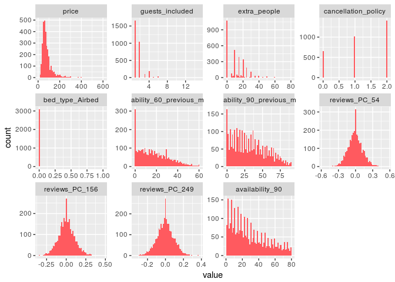
