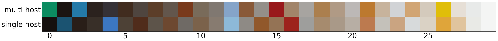

# Machine Learning Engineer Nanodegree
## Capstone Project : Detect professional hosts on AirBnB Europe.
Clement Lefevre 
July 31st, 2017

### Instructions

- Clone the repo
- Unzip the archive all_cities.zip in the same folder : those are the data already preprocessed (images, reviews text, listings features)
- Run the jupyter notebooks : A,B and C located in **src/python/**
- The Keras classifier runs on its own file : **src/python/keras_classifier.py**

-------------------------------------------------------------------

## I. Definition
_(approx. 1-2 pages)_

### Project Overview
AirBnB is an online platform for accomodation. Since its launch in 2008, it provides now 3,000,000 lodging listings in 65,000 cities and 191 countries (source : *wikipedia*).

In Berlin, amongst the 17,810 registered hosts, 13% are considered as active users (the last review was done in the last 10 days).
The first member registered in 2008, and there are 20,576 offers as of may 2017, 7700 being considered as active*.

In this study, we will focus on the full appartments offered on AirBnB in Europe, with a focus on Berlin.

For the context, here are some charts to understand the situation of Berlin amongst the others world-class cities  in term of tourism :

**active listing** : listing with an availability for the next 90 days higher than zero and with at least one review in the last 60 days.

Visitors vs spending| AirBnB renting structure
:-------------------------:|:-------------------------:
{ width=300px }|{width=300px} 

For a population of 3,5 Millions inhabitants, Berlin has a relatively low number of active offers compared to Amsterdam (population 0,85 Millions) or Barcelona (population 1,6 Millions).

Full appartments availability coming 30 days|Full appartments prices
:-------------------------:|:-------------------------:
{width=300px} |  {width=300px} 

In term of price and availability, Berin ranks in the average value on the european scale.

Since may 2016, the renting of full appartments is strictly regulated in Berlin : it requires an authorization from the city Authorities, In 2016, [only 58 authorizations have been delivered by the city for 800 applications](http://www.salon.com/2017/06/30/how-the-berlin-government-could-rein-in-airbnb-and-protect-local-housing_partner/).

On the chart below, we see the effect of this regulation : the numbers of listings drops, then rise again, with a similar trend for the price.

*see* [Airbnb Regulation: How is New Legislation Impacting the Growth of Short-Term Rentals?](http://blog.airdna.co/effects-airbnb-regulation/?utm_content=buffer896bb&utm_medium=social&utm_source=twitter.com&utm_campaign=buffer) for more details.

Evolution of active listings in Berlin | Evolution of prices
:-------------------------:|:-------------------------:
{width=300px} |  {width=300px} 

Then, looking at the localisation as of may 2017 :

|  Localization of active offers in Berlin |
|:--:|
|   |

We observe three clusters for the multihost listings in Berlin : 

- In Mitte,
- In Friedrichshain,
- In Neukoeln.

One of the consequence of the spread of such a disruptive platform is a shortage of affordable housing for the locals. 
InsideAirBnB, an online activist organization, regulary scraps the entire AirBnB offers for a selection of cities, including Berlin.

Using those data, we can identify professional hosts that potentially break the local regulation.

### Problem Statement
Using those data, we can determine which features characterize the best professional hosts (aka *multihosts*), ie hosts with more than one active listing.

|  Ratio of multihost per city |
|:--:|
|  { width=400px } |

With those selected features, we then build classification models and select the best to identify the professionals.

This model should identify at leadt 90% of the full appartments managed by a professionals.

To solve this problem, we proceed in the following steps :

- filter the dataset on the appartments (i.e full appartments) likely to be offered by professionals,
- process the raw listing provided by InsideAirBnB, the reviews text and appartments pictures,
- convert those data into usable features,
- identify the best features,
- run different classification models
- select the best one.

### Metrics
In our context, the aim is to minimize the cost of investigating potential law breakers. In other words, the model should classify the multihost with the lowest False Positive rate (listings classified as multihost, but single host in reality).

To evaluate the quality of our classification model, we will use the standard metrics : 

- recall (to evaluate the FPR)
- F1 Score (to get an overall metrics of the classifier)

## II. Analysis
_(approx. 2-4 pages)_

### Data Exploration
The dataset has been built via the  web scraping of the AirBnB website, thus we can considere this is a partial dump of the original  database. Formatted as a text file, there are around 100 features available per appartment : price, availability for the next days, picture of the appartment, number of reviews, coordinates, list of offered amenities, etc..

The dataset consists in four tables : the listings informations, the text of the reviews, the timestamp of the reviews and the booking calendar day per day for the next 365 days.

We will use the first three items to build our model.

Regarding the listing informations table,the main table with 95 features, here is a short summary :

|  Distribution of missing features in the main table |
|:--:|
|  { width=300px } |

As we can see, most of the information are present.

In order to analyse the data, we first eliminate the listing that have no availability at all, meaning the host does not rent it.
Unfortunately, we do not have the effective booking information (booking history, amount charged) for each appartment, but we can approximate them via the availability planning.

Then, we have to remove the 'zombie' host, online listing that are not active anymore. To proceed, we drop the listing for which the last review is older than two months and the availability for the next 30 days is zero :

*Example for Berlin :*

|    **room_type**    | **total_listing** | **% reviewed** | **% active** |
|:-------------------:|:-----------------:|:--------------:|:------------:|
| **Entire home/apt** |       10285       |     80.83      |    30.85     |
|  **Private room**   |       10011       |     76.65      |     28.1     |
|   **Shared room**   |        280        |     69.29      |    30.42     |

### Exploratory Visualization

Looking at the dataset, we can see the distribution of appartments per multiple ownership :

|   Listing per hosts |
|:--:|
|{ width=300px }|

There are around one third of active listing that are offered by an host who owns more than one listing. Those are our target population, i.e  professionals renting full appartments.

Number of reviews per listings rented|Availability per listings rented
:-------------------------:|:-------------------------:
|{ width=300px }|{ width=300px } 

The above charts show that professional hosts have an higher number of reviews, but also an higher availability.

|   Reviews per language |
|:--:|
|{ width=300px }|

English is the overwhemly language for reviews, we will focus then on it for the further text analysis.

### Algorithms and Techniques
We implement three different classification algorithm :

- a standard logistic regression to be used as a benchmark,
- a decision tree based algorithm : Xtra Gradient Boosting (XGBoost) Classifier : does not require much feature engineering nor hyper-parameters tuning. On top of that it is fast.
- Neural Nets based algorithm with a binary classifier using the Keras wrapper with a Tensorflow backend.

A Support vector machine approach has been excluded due to its heavy hyper parameter tuning.

### Benchmark
In this section, you will need to provide a clearly defined benchmark result or threshold for comparing across performances obtained by your solution. The reasoning behind the benchmark (in the case where it is not an established result) should be discussed. Questions to ask yourself when writing this section:
- _Has some result or value been provided that acts as a benchmark for measuring performance?_
- _Is it clear how this result or value was obtained (whether by data or by hypothesis)?_

As we are in the case of a binary classifier, a basic benchmark classifier consist in labeling all the entries as non-professional hosts (66% of the population).
We will thus use the Logistic classifier as benchmark and try to get a recall value for the professional higher than 90%.

## III. Methodology
_(approx. 3-5 pages)_

### Data Preprocessing
- **Main listing**
The main listing does not requires much preprocessing, if not split the amenities features, which in its original form combine the 100 differents possible amenities (from Dishwasher to children toys) in a single column.

- **Text reviews**
The text reviews do require a specific processing.
We use the **detect_lang** package from google to identify the language of each review.
Then, we select the reviews written in english, stemm the text with the Porter method, vectorize them using the TFIDF (term frequency-inverse document frequency) method on 2 to 3 ngrams, and finally reduce the dimensionality via the Principal Components Analsysis for each city.

Using a multinomial Bayesian classifier, we can get a rough idea of the text reviews weights :

| **Value**  |    **Single Host**    | **Value** |   **Multihost**   |
|:----------:|:---------------------:|:---------:|:-----------------:|
| **-11.87** |        - vinni        |  -6.063   |     apart wa      |
| **-11.87** |      emili apart      |   -6.27   |    no comment     |
| **-11.87** |       emili wa        |   -6.49   |   everyth need    |
| **-11.87** |       etienn wa       |  -6.569   |      wa veri      |
| **-11.87** |        imm wa         |  -6.649   |   recommend thi   |
| **-11.87** |        lar wa         |  -6.695   |     wa great      |
| **-11.87** |      lar wa veri      |  -6.696   |    great locat    |
| **-11.87** |      madelin wa       |  -6.703   |   would definit   |
| **-11.87** |      marylis wa       |  -6.706   |      - apart      |
| **-11.87** |       mauric wa       |  -6.738   | public transport  |
| **-11.87** |      stay emili       |  -6.782   |      - great      |
| **-11.87** |      stay vinni       |  -6.803   |    veri close     |
| **-11.87** |       viliu wa        |  -6.876   |     thi apart     |
| **-11.87** |      vinni great      |  -6.914   |    veri clean     |
| **-11.87** |      vinni place      |  -6.965   |      host wa      |
| **-11.87** |       vinni wa        |  -6.983   |   walk distanc    |
| **-11.84** |       mathia wa       |  -7.032   |     veri help     |
| **-11.78** |       marku wa        |  -7.042   |     wa clean      |
| **-11.74** |       live flat       |   -7.05   |    recommend -    |
| **-11.7**  |    quickli answer     |  -7.069   |      gave us      |
| **-11.65** |       week felt       |  -7.083   |  would recommend  |
| **-11.63** | neighborhood friendli |  -7.126   |     berlin -      |
| **-11.6**  |      suggest wa       |  -7.147   |    minut walk     |
| **-11.59** |    commun clearli     |  -7.161   |      - veri       |
| **-11.56** |     stay neuklln      |  -7.169   |    well equip     |
| **-11.56** |     stay wa also      |  -7.184   |     veri well     |
| **-11.56** |      left us map      |  -7.206   |    stay apart     |
| **-11.56** |    journey berlin     |  -7.221   |     veri good     |
| **-11.54** |     wa veri relax     |  -7.224   |       - wa        |
| **-11.53** |   comfort wellequip   |  -7.225   |     place wa      |
| **-11.53** |     ha love apart     |  -7.231   |    locat veri     |
| **-11.52** |   nice flat everyth   |  -7.251   |    apart veri     |
| **-11.52** |      neuklln wa       |  -7.252   |      stay -       |
| **-11.51** |     nice place wa     |   -7.26   |     come back     |
| **-11.51** |        klau wa        |  -7.268   | highli recommend  |
| **-11.5**  |   home neighborhood   |  -7.297   |     veri nice     |
| **-11.5**  |      person left      |  -7.299   |    great apart    |
| **-11.49** |    veri easi flat     |  -7.302   |     thi place     |
| **-11.49** |    recommend sure     |  -7.305   |      thi wa       |
| **-11.47** |     surround veri     |  -7.307   | definit recommend |

PCA on text reviews :

|  PC1 - PC2 on text reviews |
|:--:|
|{ width=400px }|

The first two PC for each city explain in average **20% of the variance of the Tfidf vectors**, which is pretty low compared to the greyscale PC.

TFIDF on 5000 elements, highest weights on PCA with 2 components :

index | PC1 | PC2
---- | ---- | ----
apart wa | 0.28 | -0.34
wa veri | 0.2 | -0.2
everyth need | 0.16 | 0.02
would definit | 0.15 | 0.22
recommend thi | 0.15 | 0.36
public transport | 0.13 | -0.075
veri clean | 0.12 | -0.12
veri help | 0.11 | -0.081
great locat | 0.1 | 2.7e-06
wa great | 0.1 | -0.03
stay apart | 0.096 | -0.019
veri nice | 0.094 | -0.05
wa clean | 0.087 | -0.15
flat wa | 0.086 | -0.025
walk distanc | 0.085 | 0.011
thi apart | 0.085 | 0.083
highli recommend | 0.084 | 0.13
minut walk | 0.082 | -0.036
apart veri | 0.081 | -0.018
wa veri help | 0.081 | -0.09

- **Appartements pictures**

For the pictures, after having scrapped the pictures from the Airbnb website (110,020 pictures), we implement the following operations :

- compute the brightness and contrast for each picture,
- compute the 5 top colors via a K-Means clustering on the the RGB features for each picture
- compute a greyscale numpy array for each picture.
- compute a PCA of the greyscale arraus for each city.

Multihost : PCA on 6 first Vectors | Single host : PCA on 6 first Vectors
:-------------------------:|:-------------------------:
{width=300px} |  {width=300px} 

Regarding the color clustering, the result are visually not significants :

Main colors in appartment pictures | Colors PCA
:-------------------------:|:-------------------------:
{ width=300px }|{width=300px} 

Thus, colors clustering has been removed from the features.

The PCA implementation at the level of the city is justified by the limited computing resources. Otherwise, it would have been optimal to run a PCA on both greyscale picture and TFIDF text vectors on the whole dataset.

- **Reviews frequency and language ratio**

For the review languages, i compute for each listing the ratio of reviews for each language.
For the frequency of the reviews, i aggregated the number of reviews in 11 bins : from **less than 1 day since the scraping date**, to **more than 200 days since scraping date**

### Implementation
The main challenge for this model is the feature selection. With 300 differentes features, and very low correlation with the target (best correlation, **maximum nights**, scores  ${\rho}$ = 0.145 with the **multi-host** target.)

- **Features selection**

Now we can check .
To select the most relevant features from the listing table to predict the multihosting, i used three differents techniques :

- RandomizedLogisticRegressor,
- KBest features selection based on Chi2 and FScore,
- best F-score features from a basic XGBoost classifier.

When those four list are combined, we obtain a list of 100 features.

For this we use the ${\chi}^2$ test on the numerical values :

|  ${\chi}^2$ best features  |
|:--:|
|{ width=500px }|

|  XGBoost best features  |
|:--:|
|{ width=500px }|

| XGB best fclass features  |
|:--:|
|{ width=500px }|

### Refinement
I used the different combination of features :

- with the RandomizedLogisticRegressor features only,
- with the 20 ${\chi}^2$ best Features,
- with the 20 F-score best features,
- with the 20 best XGBoost Faeatures,
- with all the features combined.

And applied them on classification models :

- logistics regressor,
- random Forest Classifier,
- XGBoost Classifier
- A Neural Net with a relu activation in input and a sigmoid in output with an adam optimizer.

Before applying the train/test split, i first rebalanced the original dataset (1/3 multihost vs 2/3 single host) to get a 50/50 distribution.

Using a standard Logistic Regressor on the features provided by the RandomizedLogisticRegressor, we can reach an accuracy of 76%, with a recall of 77%. Lowest results were provided by the Random Forest without tuning, and the Keras Neural net got the same result as the logistics regressor.

It is finally the XGBoost Classifier that got both 80% in accuracy and recall.

## IV. Results
_(approx. 2-3 pages)_

### Model Evaluation and Validation
With a cross-validation of the training set on 5 folds on a 12231 samples (training set)  and 8154 testing samples, we get the following results :

_Recall:_ 0.79% (+/- 0.02)

_confusion matrix on the testing set :_

   /  | single host | multihost
---- | ---- | ----
single host|3216 | 886
multihost|829 |3223

_classification matrix on the testing set :_

 /         | precision | recall | f1-score | support
----       | ----      | ----   | ----     |  -----
single host|   0.80    |   0.78 |   0.79   |  4102
multi host  |  0.78   |   0.80   |   0.79    |  4052
avg / total |       0.79   |   0.79    |  0.79   |   8154

The fact i used cross-validation and evaluate the model on the testing set after a random balanced sampling makes us confident of the reliability of the result.

_ROC Curve for the XGBoost Classifier_ :

|  ROC curve for XGB model |
|:--:|
|  { width=300px } |

### Justification
Though the XGB model outperforms the benchmark (Logistics Regressor), it is still does not reach our 90% recall objectif, making it hardly production-grade. We could raise the standard 0.5 probability threshold to 0.7 and get a better recall.

## V. Conclusion
_(approx. 1-2 pages)_

### Free-Form Visualization
When looking at the first 2 PC of the entire features set PCA :

|  PC1 vs PC2 all features |
|:--:|
|  { width=300px } |

From this chart, it is obvious that the two categories are hardly separable.

|  Top 10 feature for the XGB Classifier |
|:--:|
|  { width=300px } |

### Reflection
The objective was ambitious and the data available have required more work than the modeling phase.
When i first used the data for Berlin only, the size of the dataset was not large enough to get stable recall values on the dataset. I then had to extend the scope to thirteen european cities.
Though, the recall obtain (80% at best) is not satisfying.

Morevoer, I did put heavy expectation on the neural net, but after hundreds of iteration the model stuck on the validation recall of 76%, i.e. as good as a basic logistics regression.

There is a major flaw in my project : the defition of professional is per se not accurate ; one professional might offer only one listing on Airbnb, or use two differents identities to rent its appartments.

### Improvement
If my time was not constrained, i would add more features : profile pictures of the guest, define a list of touristic/interest location per city and compute the distance to it.

I used the *tpot* python package to identify the best model possible (excluding the deep learning option), and the best proposal was the XGBoost. As the categories are definitively not lineary separable, i would put more emphasis on a SVM classifier with a RBF kernel, which requires lots of hyper-parameter tuning.

-----------

