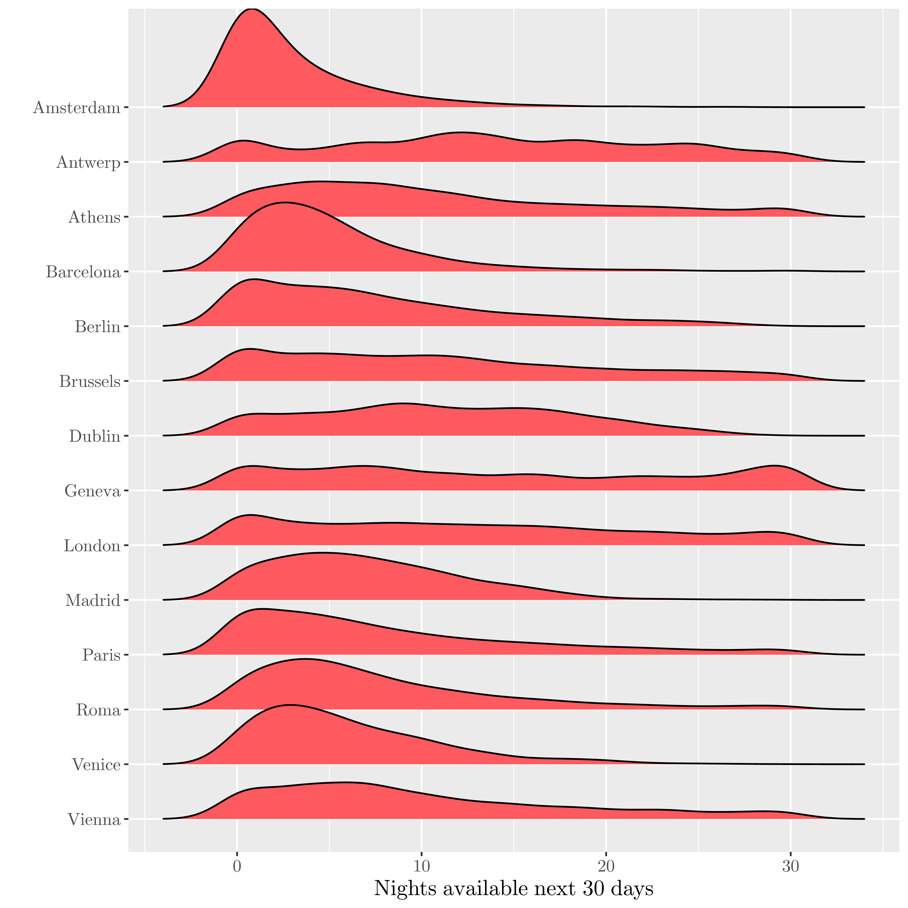
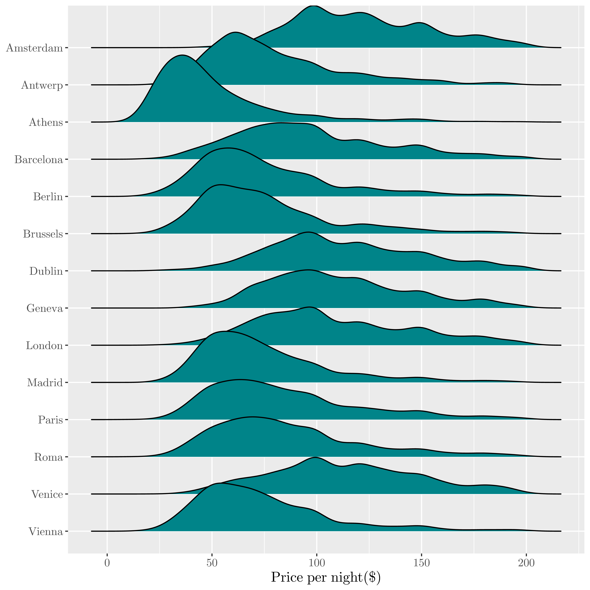
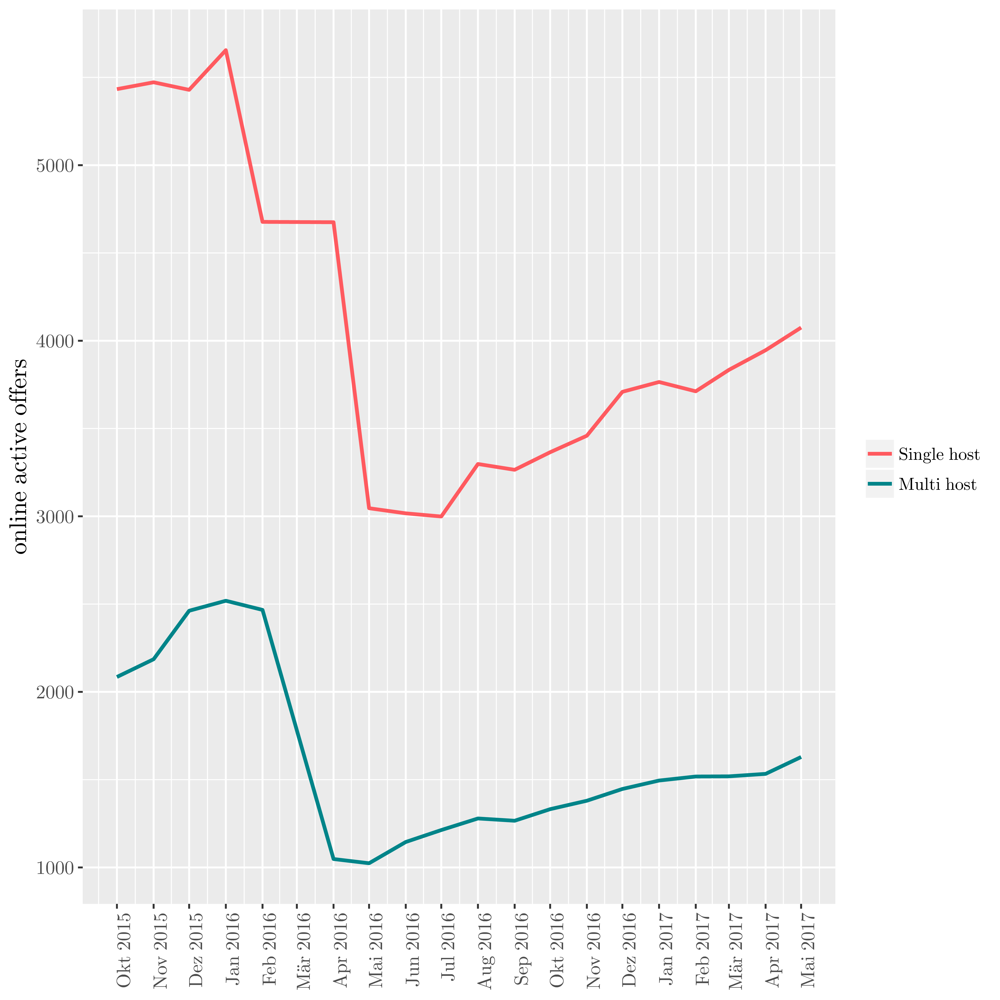
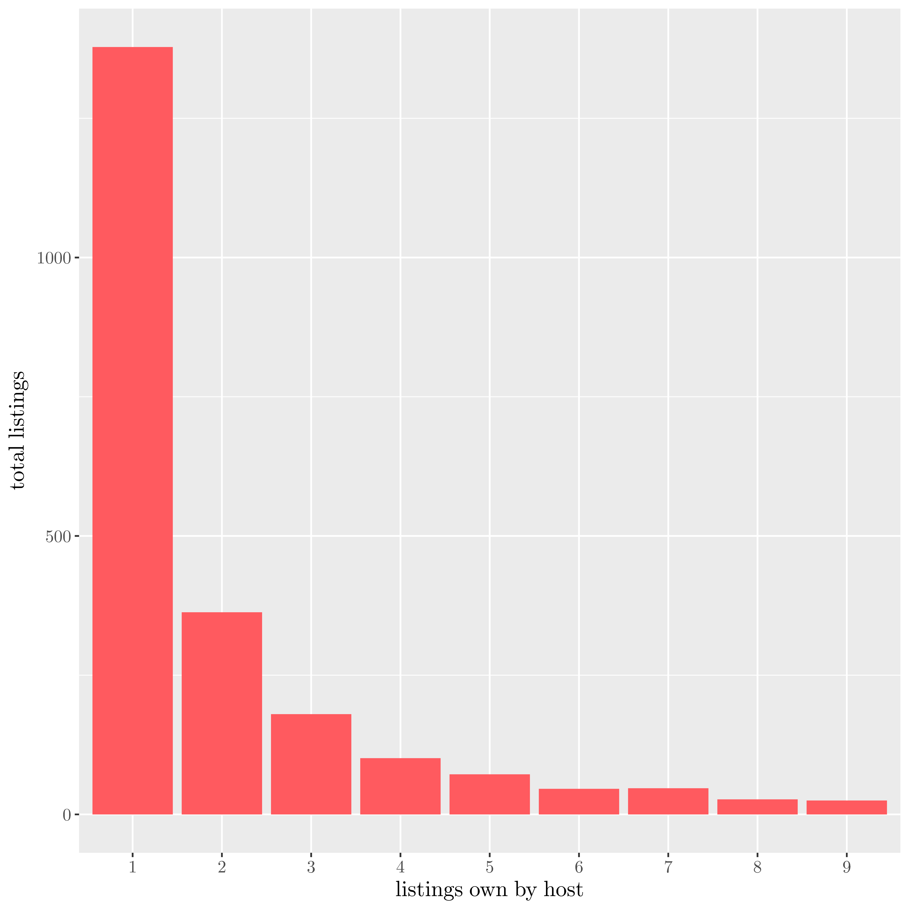
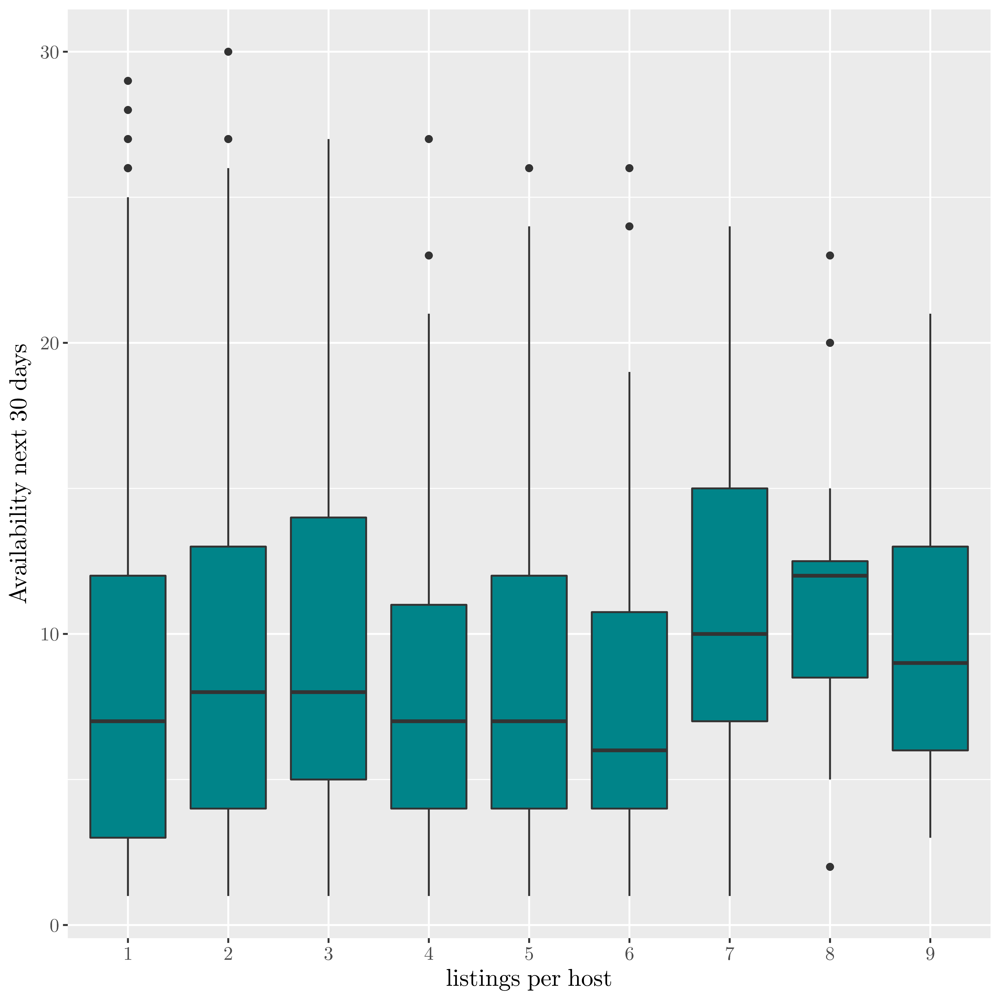
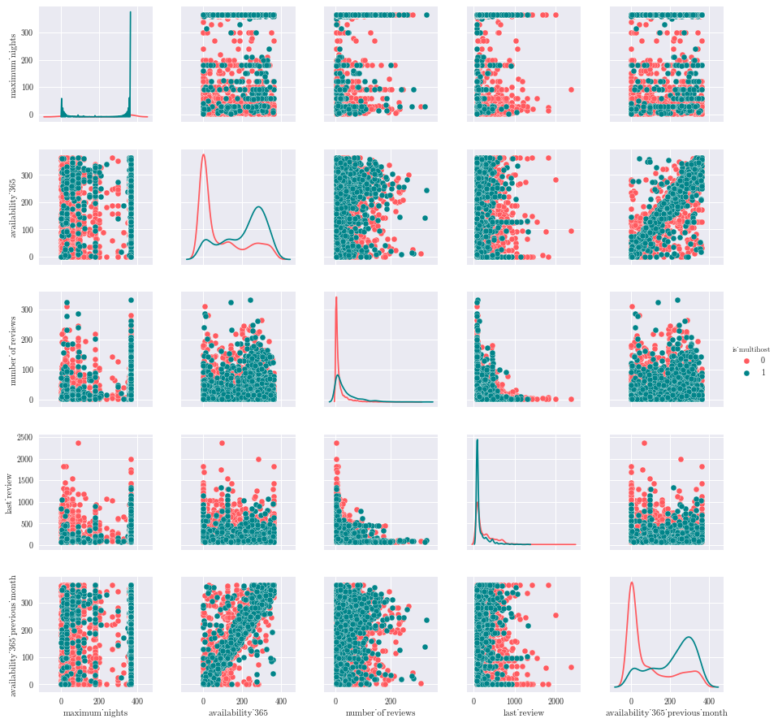

---
output:
  pdf_document: default
  html_document: default
---
# Machine Learning Engineer Nanodegree
## Capstone Project : Forecast appartment bookings for AirBnB Berlin.
Clement Lefevre 
July 31st, 2017

## I. Definition
_(approx. 1-2 pages)_

### Project Overview
AirBnB is an online platform for accomodation. Since its launch in 2008, it provides now 3,000,000 lodging listings in 65,000 cities and 191 countries (source : wikipedia)
In Berlin, amongst the 17810 registered hosts, 13% are considered as active users (the last review was done in the last 10 days).
The first member registered in 2008, and there are 20576 offers as of may 2017.

In this study, we will focus on the full appartments to be rented on AirBnB in Berlin.

For the context, here are some self-explanotory charts to understand the situationof Berlin amongst the others world-class cities  in term of tourism :
Visitors vs spending|AirBnB renting structure
:-------------------------:|:-------------------------:
{ width=300px } | {width=300px} 

Looking at other european cities :

Full appartments availability coming 30 days|Full appartments prices
:-------------------------:|:-------------------------:
{width=300px} |  {width=300px} 

The full renting of an appartment is strictly regulated in Berlin :it requires an authorization from the city Authorities, In 2016, [only 58 authorizations have been delivered by the city for 800 applications](http://www.salon.com/2017/06/30/how-the-berlin-government-could-rein-in-airbnb-and-protect-local-housing_partner/).

One of the consequence of the spread of such a disruptive platform is a shortage of affordable housing for the locals. 
InsideAirBnB, an online activist organization, regulary scraps the entire AirBnB offers for a selection of cities, including Berlin.
Using those data, we can identify professional hosts that potentially break the local regulation.

Evolution of active listings in Berlin | Mapping
:-------------------------:|:-------------------------:
{width=300px} |  {width=300px} 

### Problem Statement
Using those data, we can determine which features characterize the best professional hosts. With those selected features, we will then build different classification models and select the best to identify the professionals.

Our aim is to predict whether an appartment will have an occupacy ratio higher or equals to the average ratio of Berlin's hotel (77% in 2015/2016) for the next 30 days.

To solve this problem, we proceed in the following steps :

- filter the dataset on the appartments (i.e full appartments) likely to be offered by professionals,
- process the reviews text and appartments pictures and convert them into usable features,
- define the best features,
- run different classification models to select the best one.

### Metrics
In our context, the aim is to minimize the cost of investigating potential law breakers.
To evaluate the quality of our classification model, we will use the standard metrics : recall and F1 Score.
In our context, the recall is the percentage of appartments we correctly predicted as professional.
We use the F1 score as ameasue of the overall performance of the classifier.

## II. Analysis
_(approx. 2-4 pages)_

### Data Exploration
The dataset has been built via the  web scraping of the AirBnB website, thus we can considere this is a partial dump of the original  database. Formatted as a text file, there are around 100 features available per appartment : price, availability for the next days, picture of the appartment, number of reviews, coordinates, list of offered amenities, etc..

The dataset consists in three tables : the listings informations, the text of the reviews, the timestamp of the reviews and the booking calendar day per day for the next 365 days.
We will use the first three items to build our model.

Regarding the listing informations table,the main table with 95 features, here is a short summary :

|  Distribution of missing features in the main table |
|:--:|
|  { width=300px } |

As we can see, most of the information are present.

In order to analyse the data, we first eliminate the listing that have no availability at all, meaning the host does not rent it.
Unfortunately, we do not have the effective booking information (booking history, amount charged) for each appartment, but we can approximate them via the availability planning.

Then, we have to remove the 'zombie' host, online listing that are not active anymore. To proceed, we drop the listing for which the last review is older than two months and the availability for the next 30 days is zero :

|    **room_type**    | **total_listing** | **% reviewed** | **% active** |
|:-------------------:|:-----------------:|:--------------:|:------------:|
| **Entire home/apt** |       10285       |     80.83      |    30.85     |
|  **Private room**   |       10011       |     76.65      |     28.1     |
|   **Shared room**   |        280        |     69.29      |    30.42     |

### Exploratory Visualization

Looking at the dataset, we can see the distribution of appartments per multiple ownership :

|   Listing per hosts |
|:--:|
|{ width=300px }|

There are around one third of active listing that are offered by an host who owns more than one listing. Those are our target population, i.e the professional renting full appartments.

Number of reviews per listings rented|Availability per listings rented
:-------------------------:|:-------------------------:
|{ width=300px }|{ width=300px } 

The above charts show that professional hosts have an higher number of reviews, but a also an higher availability.

Now we can chekc which features from the listing table are the most relevant to predict the multihosting. For this i use the ${\chi}^2$ test on the numerical values :

|  ${\chi}^2$ best features  |
|:--:|
|{ width=500px }|

|   Reviews per language |
|:--:|
|{ width=300px }|

### Algorithms and Techniques
We implement three different classification algorithm :

- a standard logistic regression to be used as a benchmark,
- a decision tree based algorithm : Xtra Gradient Boosting (XGBoost) Classifier : does not require much feature engineering nor hyper-parameters tuning. On top of that it is fast.
- Neural Nets based algorithm with a binary classifier using the Keras wrapper with a Tensorflow backend.

A Support vector machine approach has been excluded due to its heavy hyper parameter tuning.

### Benchmark
In this section, you will need to provide a clearly defined benchmark result or threshold for comparing across performances obtained by your solution. The reasoning behind the benchmark (in the case where it is not an established result) should be discussed. Questions to ask yourself when writing this section:
- _Has some result or value been provided that acts as a benchmark for measuring performance?_
- _Is it clear how this result or value was obtained (whether by data or by hypothesis)?_

As we are in the case of a binary classifier, a basic benchmark classifier consist in labeling all the entries as non-professional hosts (66% of the population).
We will thus use the Logistic classifier as benchmark and try to get a recall value for the professional higher than 90%.

#%# III. Methodology
_(approx. 3-5 pages)_

### Data Preprocessing
In this section, all of your preprocessing steps will need to be clearly documented, if any were necessary. From the previous section, any of the abnormalities or characteristics that you identified about the dataset will be addressed and corrected here. Questions to ask yourself when writing this section:
- _If the algorithms chosen require preprocessing steps like feature selection or feature transformations, have they been properly documented?_
- _Based on the **Data Exploration** section, if there were abnormalities or characteristics that needed to be addressed, have they been properly corrected?_
- _If no preprocessing is needed, has it been made clear why?_

The text reviews and apparments pictures need processing :

For the reviews, first select the reviews written in english, vectorize them using the TFIDF method and finally reduce the dimensionality via the Principal Components Analsysis.

For the pictures, after having scrapped the pictures and converted them into numpy arrays, we work in three steps :

- compute the brightness and contrast,
- compute the 5 top colors,
- compute a PCA for the greyscale pictures.

### Implementation
In this section, the process for which metrics, algorithms, and techniques that you implemented for the given data will need to be clearly documented. It should be abundantly clear how the implementation was carried out, and discussion should be made regarding any complications that occurred during this process. Questions to ask yourself when writing this section:
- _Is it made clear how the algorithms and techniques were implemented with the given datasets or input data?_
- _Were there any complications with the original metrics or techniques that required changing prior to acquiring a solution?_
- _Was there any part of the coding process (e.g., writing complicated functions) that should be documented?_

### Refinement
In this section, you will need to discuss the process of improvement you made upon the algorithms and techniques you used in your implementation. For example, adjusting parameters for certain models to acquire improved solutions would fall under the refinement category. Your initial and final solutions should be reported, as well as any significant intermediate results as necessary. Questions to ask yourself when writing this section:
- _Has an initial solution been found and clearly reported?_
- _Is the process of improvement clearly documented, such as what techniques were used?_
- _Are intermediate and final solutions clearly reported as the process is improved?_

## IV. Results
_(approx. 2-3 pages)_

### Model Evaluation and Validation
In this section, the final model and any supporting qualities should be evaluated in detail. It should be clear how the final model was derived and why this model was chosen. In addition, some type of analysis should be used to validate the robustness of this model and its solution, such as manipulating the input data or environment to see how the model’s solution is affected (this is called sensitivity analysis). Questions to ask yourself when writing this section:
- _Is the final model reasonable and aligning with solution expectations? Are the final parameters of the model appropriate?_
- _Has the final model been tested with various inputs to evaluate whether the model generalizes well to unseen data?_
- _Is the model robust enough for the problem? Do small perturbations (changes) in training data or the input space greatly affect the results?_
- _Can results found from the model be trusted?_

### Justification
In this section, your model’s final solution and its results should be compared to the benchmark you established earlier in the project using some type of statistical analysis. You should also justify whether these results and the solution are significant enough to have solved the problem posed in the project. Questions to ask yourself when writing this section:
- _Are the final results found stronger than the benchmark result reported earlier?_
- _Have you thoroughly analyzed and discussed the final solution?_
- _Is the final solution significant enough to have solved the problem?_

## V. Conclusion
_(approx. 1-2 pages)_

### Free-Form Visualization
In this section, you will need to provide some form of visualization that emphasizes an important quality about the project. It is much more free-form, but should reasonably support a significant result or characteristic about the problem that you want to discuss. Questions to ask yourself when writing this section:
- _Have you visualized a relevant or important quality about the problem, dataset, input data, or results?_
- _Is the visualization thoroughly analyzed and discussed?_
- _If a plot is provided, are the axes, title, and datum clearly defined?_

### Reflection
In this section, you will summarize the entire end-to-end problem solution and discuss one or two particular aspects of the project you found interesting or difficult. You are expected to reflect on the project as a whole to show that you have a firm understanding of the entire process employed in your work. Questions to ask yourself when writing this section:
- _Have you thoroughly summarized the entire process you used for this project?_
- _Were there any interesting aspects of the project?_
- _Were there any difficult aspects of the project?_
- _Does the final model and solution fit your expectations for the problem, and should it be used in a general setting to solve these types of problems?_

### Improvement
In this section, you will need to provide discussion as to how one aspect of the implementation you designed could be improved. As an example, consider ways your implementation can be made more general, and what would need to be modified. You do not need to make this improvement, but the potential solutions resulting from these changes are considered and compared/contrasted to your current solution. Questions to ask yourself when writing this section:
- _Are there further improvements that could be made on the algorithms or techniques you used in this project?_
- _Were there algorithms or techniques you researched that you did not know how to implement, but would consider using if you knew how?_
- _If you used your final solution as the new benchmark, do you think an even better solution exists?_

-----------

**Before submitting, ask yourself. . .**

- Does the project report you’ve written follow a well-organized structure similar to that of the project template?
- Is each section (particularly **Analysis** and **Methodology**) written in a clear, concise and specific fashion? Are there any ambiguous terms or phrases that need clarification?
- Would the intended audience of your project be able to understand your analysis, methods, and results?
- Have you properly proof-read your project report to assure there are minimal grammatical and spelling mistakes?
- Are all the resources used for this project correctly cited and referenced?
- Is the code that implements your solution easily readable and properly commented?
- Does the code execute without error and produce results similar to those reported?

A footnote [^1]
[^1]: Here is the footnote. 
